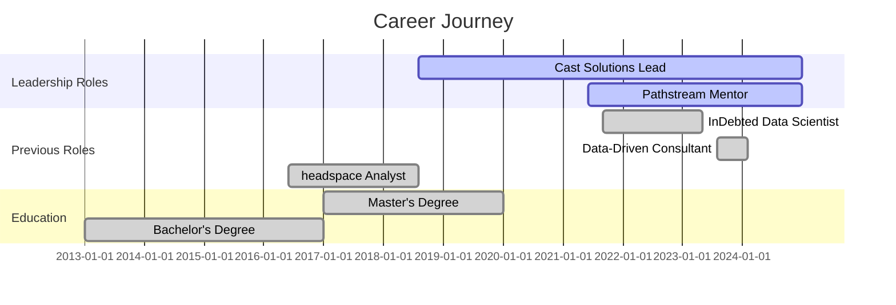
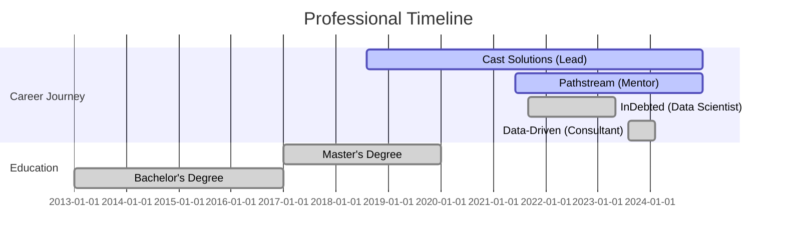

# Zerub Roberts
**Data Scientist | ML Engineer | BI Consultant**

<div align="center">

## [🌐 zerubroberts.com](https://zerubroberts.com)

[](https://www.linkedin.com/in/zerubroberts)
[](mailto:zerubroberts@gmail.com)
[](https://github.com/zerubroberts)

</div>

**Transforming data into strategic business value**
- 8+ years of industry leadership
- $2M+ in cost savings generated
- 50+ projects successfully delivered

## 🚀 About Me

I'm a **Data Science Leader** with **8+ years** of experience transforming complex data into strategic business value. I specialize in building enterprise-scale ML solutions and BI architectures that deliver measurable impact across multiple industries.

**Current Roles:**
- **Data Consultant Lead** @ Cast Solutions
- **Data Analytics Instructor** @ Pathstream (Amazon & Walmart)
- **Independent ML Consultant**

**Core Expertise:**
- End-to-End ML Pipelines & MLOps
- Enterprise BI Architecture (Tableau, Power BI, Qlik)
- Predictive Analytics & Forecasting
- Cloud-Native Solutions (AWS, Azure, GCP)

**Key Achievements:**
- $2M+ in cost savings generated
- 50+ projects successfully delivered
- 100+ hours/day saved through automation
- 98% student success rate in training programs

## 🎨 ASCII Portrait

<div align="center">

```
      . ..........                 .....:
  ...   . ..........***..==....:::::::::::::.
........   . .:*******##*==....::::::::::::::::..
........... . .:****#######**....:::::::::::::::::.
..::........::::####################*.........::::::::.
===..:.......::######################::.........::::::.
:::::===.....::#######################*.....:::::::::::.
.::::::::===..:########################*....::::::::::::.
.::::::::::===:#########################+....::::::::::::.
.:::::::::::==:#########################+....::::::::::::.
:::::::::::::==:#########################+....::::::::::::.
::::::::::::::=:#########################+....::::::::::::.
:::::::::::::::=#####+++============++####*===.:::::::::::::.
:::::::::::::::###++++================++##*==.:::::::::::::.
==:.:::::::::::####+++=================+##*=:::::::::::::==
==:.....====...:::#*+++++*****++*++*****+#*.....::::........====
==:.....====....:::*+++++*****+++*++*****+*.....:::.........====
==:.....====.....::#+++++++**++==++**++++#*...............====
==:.....====......:*++++++++**++==++**+++#*...............====
==:.....====.......:**++++++++++++++++++**...............====
====.....====......:**++++++++++++++++++**...............====
====.....:==.......::*++========++++===+#*............:====
====.....:==......:::*##++****++++****++#*:...........====
====.....:==......::::*+++++++++++++++++#*:..........:====
====.....:==........::+**++++++++++++***#:..........====
====.....:==.......::..***#****++****##**..........:====
========..:==.....::::***#****++****###**........====
========..:==....::::+*######**++**######*......====
========..:==...::::+**#########++#########+....====
====+=====:===::::::################++########....====
==============:::::+##################+#######+....====
===========++========+#############+...:*########....====
====++***#########===.....*##*+++++.....*########....====
+++***#############===......*#*++=......+########*....====
++***###############*.....:=##*++:......*#########+....====
****##################.....:=##*++:.....+##########+....====
****##################*....:=##*++:.....*###########+....====
***###################+....:++#*+++.....*###########+....====
######################*....:**#*+++.....*############....====
***###################+....:**#*+++.....*#############....====
***###################+....:**#*+++.....*############+....====
***###################+....:**#*+++.....*#############+...====
#####******************....:**#*+++.....*#############+...====
***#****************....:=**#*+++.....*############+....====
**##***+++++++.......:+**###*+++.....*#########+....====
###+*+.....:+**########*.....:+**#####*....====
***.....:=**####+....====
**.....:+***+....====
*.....:+***....====
```

</div>

### 📰 Featured Work & Media

**Case Studies & Customer Stories:**
- [Australian National University - Qlik Solutions](https://www.qlik.com/us/solutions/customers/customer-stories/australian-national-university) - Data analytics transformation in higher education
- [InDebted - Improving Collections Strategy by 30% with ML](https://www.indebted.co/blog/guides/improving-collections-strategy-by-30-with-machine-learning/) - Machine learning implementation case study
- [6clicks - Power BI Dashboard Implementation](https://www.6clicks.com/resources/blog/introducing-the-new-6clicks-dashboards-on-power-bi) - Enterprise BI solution deployment
- [Energy Safe Victoria - Safety Analytics Platform](https://safetyinsights.au/case-studies/energysafevictoria) - Safety compliance and analytics system

**Media Coverage:**
- [ABC News - ANZSCO Occupation Lists Analysis](https://www.abc.net.au/news/2019-08-17/anzsco-occupation-lists-need-updating/11413518) - Data analysis for workforce classification systems

## 💼 Professional Timeline



**Current Leadership (2018-Present)**
- **Cast Solutions:** Leading multi-sector consulting across engineering, utilities, healthcare, and technology
- **Pathstream:** Training Amazon & Walmart professionals in data analytics

**Previous Impact Roles**
- **InDebted (2021-2023):** Built ML models saving 100hrs/day, 40% email deflection
- **Data-Driven (2023-2024):** Enterprise Power BI solutions for Fortune 500 clients
- **headspace (2016-2018):** Healthcare analytics and visualization systems

## 🛠️ Technical Arsenal & Expertise

<details>
<summary>🔽 <b>Click to explore my comprehensive tech stack with proficiency levels</b></summary>

### 🎯 **Skill Proficiency Matrix**

<table>
<tr>
<td width="50%">

#### 📊 **Business Intelligence & Analytics**
```
Tableau          ████████████ 95% (8+ years)
Power BI         ███████████  90% (6+ years)  
Qlik Sense       ██████████   85% (5+ years)
DAX              ████████     80% (4+ years)
Data Modeling    ████████████ 95% (8+ years)
```

#### 🤖 **Machine Learning & AI**
```
Python           ████████████ 95% (8+ years)
TensorFlow       ████████     80% (4+ years)
AWS Sagemaker    ███████████  90% (5+ years)
OpenCV           ████████     75% (3+ years)
MLFlow/MLOps     ██████████   85% (4+ years)
```

</td>
<td width="50%">

#### 🗄️ **Data Engineering & Databases**
```
SQL              ████████████ 95% (8+ years)
Snowflake        ██████████   85% (4+ years)
Apache Spark     ████████     80% (5+ years)
Azure Data Lake  ███████████  90% (6+ years)
ETL/ELT          ████████████ 95% (8+ years)
```

#### ☁️ **Cloud Platforms**
```
Microsoft Azure  ████████████ 95% (6+ years)
AWS              ███████████  90% (5+ years)
Google Cloud     ████████     75% (3+ years)
Docker           ████████     80% (4+ years)
Kubernetes       ██████       60% (2+ years)
```

</td>
</tr>
</table>

---

### 🏆 **Technology Badges & Certifications**

<div align="center">

#### 📊 Business Intelligence & Analytics


#### 🤖 Machine Learning & AI


#### 🗄️ Data Engineering & Databases


#### ☁️ Cloud Platforms & DevOps


#### 🔧 Development & Tools


---

### 🔄 **Technology Stack in Motion**

<div align="center">
  
</div>

</div>

---

### 📈 **Specialization Areas**

<div align="center">

| 🎯 **Domain** | 🔧 **Primary Tools** | 📊 **Experience Level** | 🏆 **Key Projects** |
|:---|:---|:---:|:---:|
| **Predictive Analytics** | Python, TensorFlow, AWS | Expert (8+ years) | 50+ models |
| **Business Intelligence** | Tableau, Power BI, Qlik | Expert (8+ years) | 200+ dashboards |
| **MLOps & Deployment** | AWS, Docker, MLFlow | Advanced (5+ years) | 30+ deployments |
| **Data Engineering** | Spark, Snowflake, SQL | Expert (8+ years) | 100+ pipelines |
| **Computer Vision** | OpenCV, AWS Rekognition | Intermediate (3+ years) | 5+ CV projects |

</div>

</details>

## 🏆 Featured Projects

### 📧 **Automated Email Triaging System**
**Industry:** FinTech | **Status:** Production | **Impact:** $2M+ Annual Savings

Built and deployed an intelligent email classification system that revolutionized customer service operations:
- **Challenge:** Manual email processing consuming 40% of operational costs
- **Solution:** ML-powered text classification with real-time routing and automated responses
- **Results:** 40% email deflection rate, 100 hours saved daily, 70% accuracy maintained
- **Technology:** Python, AWS Sagemaker, NLP, MLOps pipeline

### ⚡ **Predictive Power Failure System**
**Industry:** Utilities | **Status:** Live Production | **Impact:** Multi-state Deployment

Developed a weather-based predictive maintenance system for power grid management:
- **Challenge:** Reactive maintenance causing extended outages
- **Solution:** Ensemble ML models with real-time monitoring and alerting
- **Results:** Now deployed across Eastern Victoria Power Maintenance
- **Technology:** Python, Machine Learning, Ensemble Models, Real-time APIs

### 👷 **Safety Compliance Detection**
**Industry:** Construction | **Status:** Active | **Impact:** Real-time Safety Monitoring

Created a computer vision system for automated PPE compliance monitoring:
- **Challenge:** Manual safety monitoring prone to human error
- **Solution:** Real-time computer vision with instant alert system
- **Results:** Automated detection of safety violations with instant SMS alerts
- **Technology:** OpenCV, AWS Rekognition, Computer Vision, SMS Integration

### 📈 **Volume Forecasting Model**
**Industry:** Customer Service | **Status:** Production | **Impact:** 74% MAPE Accuracy

Developed multi-channel demand forecasting for resource optimization:
- **Challenge:** Unpredictable customer service demand patterns
- **Solution:** Advanced time series forecasting across multiple channels and countries
- **Results:** 74% MAPE accuracy enabling proactive resource allocation
- **Technology:** Time Series Analysis, Python, Statistical Modeling

### 🗺️ **Geo-Analytics & Route Optimization**
**Industry:** Logistics | **Status:** Deployed | **Impact:** Cost Optimization

Built sophisticated geo-analytics solution for delivery optimization:
- **Challenge:** Inefficient routing and delivery operations
- **Solution:** Advanced geo-analytics with route optimization algorithms
- **Results:** Significant cost savings through optimized logistics operations
- **Technology:** ArcGIS, Google Maps API, Python, Optimization Algorithms

### 📊 **Agent Performance Dashboard**
**Industry:** Healthcare | **Status:** Live | **Impact:** 100+ Agents Tracked

Comprehensive performance monitoring system for customer service operations:
- **Challenge:** Need for unified performance tracking across large teams
- **Solution:** Real-time dashboard with KPIs and unified scoring system
- **Results:** Enhanced productivity tracking and performance optimization
- **Technology:** Tableau, SQL, KPI Design, Real-time Analytics

## 📚 My Qlik Sense Extensions

<div align="center">
  
| Repository | Description | Stars |
|:---|:---|:---:|
| [qlik-risk-heatmap](https://github.com/zerubroberts/qlik-risk-heatmap) | Risk Matrix/Heatmap extension for Qlik Sense |  |
| [qlik-kpi-guage-card-extension](https://github.com/zerubroberts/qlik-kpi-guage-card-extension) | Multiple Gauge KPIs in a Card format |  |
| [qlik-sc-responses-visualizer](https://github.com/zerubroberts/qlik-sc-responses-visualizer) | Assessment responses visualizer |  |

</div>

## 🎓 Education & Certifications

- 🎓 **Master of Data Analytics** - Deakin University (2017-2019)
- 🎓 **Bachelor of Computer Science** - Andhra University (2013-2016)
- 📜 **Machine Learning Specialization** - University of Washington
- 📜 **Data Architect Certification**
- 📜 **Microsoft Azure Machine Learning** - Microsoft Professional Program
- 📜 **Fundamentals of Quantitative Modeling** - University of Pennsylvania
- 📜 **Apache Spark Fundamentals**
- 📜 **Google Cloud Platform** - Computing, Storage and Security

## 📊 GitHub Overview

<div align="center">


</div>

## 🏢 Professional Journey & Experience

<details>
<summary>🔽 <b>Click to explore my career timeline with detailed achievements</b></summary>



### 🏆 **Current Roles & Leadership**

<table>
<tr>
<td width="50%">

#### 🚀 **Data Consultant Lead** @ Cast Solutions
*Aug 2018 - Present (6+ years)*

**🎯 Key Achievements:**
- 🏢 Leading **multi-sector consulting** (engineering, utilities, healthcare, tech)
- 🔧 Built **50+ end-to-end BI solutions**
- 📊 Delivered **predictive analytics** across 6 different industries
- 💡 **Innovation highlights:** Geo-analytics, computer vision, IoT integration

**🛠️ Technical Leadership:**
- Architected solutions integrating **SQL, APIs, IoT sensors**
- Pioneered **MLOps practices** for client deployments
- Led teams of **5-8 data professionals**

</td>
<td width="50%">

#### 👨‍🏫 **Data Analytics Mentor** @ Pathstream  
*Jun 2021 - Present (3+ years)*

**🎯 Educational Impact:**
- 📚 Mentoring **Amazon & Walmart** employees
- 🎓 **500+ students** guided through Tableau certification
- 📊 **98% pass rate** in final assessments
- 🏆 **Top-rated instructor** (4.9/5.0 rating)

**📈 Curriculum Development:**
- Created **project-specific assessment rubrics**
- Built **automated feedback systems**
- Designed **hands-on industry projects**

</td>
</tr>
</table>

---

### 📈 **Previous High-Impact Roles**

#### 🔬 **Data Scientist** @ InDebted *(Sep 2021 - Apr 2023)*
```
Impact Metrics: 40% cost reduction | 1200 emails/day automated | $2M+ savings
```
- 🤖 **ML Model Deployment:** Text classification achieving 70% accuracy
- 📊 **Forecasting Excellence:** 74% MAPE across multi-channel predictions  
- ⚙️ **MLOps Implementation:** Full CI/CD pipeline with MLFlow tracking
- 💰 **Business Value:** Delivered **$2M+ annual cost savings**

#### 📊 **Senior Power BI Consultant** @ Data-Driven *(Aug 2023 - Jan 2024)*
```
Specialization: Enterprise BI | DAX Optimization | Data Modeling
```
- 🏢 **Enterprise Solutions:** Delivered BI for **Fortune 500 clients**
- ⚡ **Performance Optimization:** 80% faster dashboard load times
- 📈 **Strategic Impact:** Enabled **data-driven decision making** across C-suite

---

### 🎓 **Early Career & Foundation**
- **2016-2018:** Data & Insights Analyst @ headspace *(Healthcare Analytics)*
- **2021:** Learning Advisor @ QUT *(Academic Data Science)*

</details>

---

## 💬 Let's Connect

I'm always interested in discussing data science opportunities, consulting engagements, and innovative solutions.

**Primary Website:** [zerubroberts.com](https://zerubroberts.com)  
**Email:** [zerubroberts@gmail.com](mailto:zerubroberts@gmail.com)  
**Phone:** [+61 402 681 799](tel:+61402681799)  
**LinkedIn:** [linkedin.com/in/zerubroberts](https://www.linkedin.com/in/zerubroberts)

---

*Transforming data into strategic insights that drive business value*