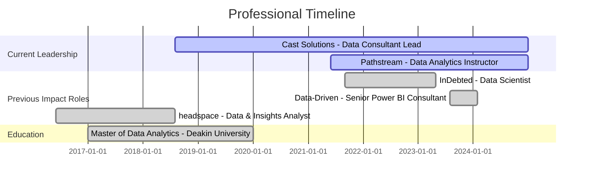

<div align="center">

<!-- HERO BANNER -->


<h1>
  
</h1>

<p align="center">
  
  
  
  
</p>

<br/>

<!-- WEBSITES & PRODUCTS -->
<h3>🌐 My Digital Presence</h3>

<table>
<tr>
<td align="center" width="25%">
<a href="https://zerubroberts.com">

<br/><b>Portfolio Website</b>
<br/><sub>zerubroberts.com</sub>
</a>
</td>
<td align="center" width="25%">
<a href="https://github.com/zerubroberts">

<br/><b>GitHub Projects</b>
<br/><sub>Open Source Extensions</sub>
</a>
</td>
<td align="center" width="25%">
<a href="https://www.linkedin.com/in/zerubroberts">

<br/><b>LinkedIn Profile</b>
<br/><sub>Professional Network</sub>
</a>
</td>
<td align="center" width="25%">
<a href="mailto:zerubroberts@gmail.com">

<br/><b>Email Contact</b>
<br/><sub>zerubroberts@gmail.com</sub>
</a>
</td>
</tr>
</table>

<br/>

<!-- CURRENT ROLES -->
<table>
<tr>
<td align="center">

<br/><b>Data Consultant Lead</b>
<br/><sub>Cast Solutions</sub>
</td>
<td align="center">

<br/><b>Data Analytics Instructor</b>
<br/><sub>Pathstream (Amazon & Walmart)</sub>
</td>
<td align="center">

<br/><b>Independent ML Consultant</b>
<br/><sub>Enterprise Solutions</sub>
</td>
</tr>
</table>

<br/>

<!-- IMPACT METRICS -->
<p align="center">
  
  
  
</p>

</div>

<br/>

---

## 🎯 About Me

<table>
<tr>
<td width="60%" valign="top">

### 👨‍💻 Who I Am

I'm a **Senior Data Scientist & AI Solutions Architect** with **8+ years** of proven expertise in transforming complex data ecosystems into strategic business value. I specialize in building enterprise-scale ML solutions, predictive analytics systems, and BI architectures that deliver measurable ROI across Fortune 500 companies.

### 🎯 What I Do

**🚀 Current Focus Areas:**
- Leading end-to-end data transformation projects for enterprise clients
- Building production-grade ML pipelines with full MLOps implementation  
- Architecting cloud-native BI solutions on Azure, AWS, and GCP
- Mentoring data professionals at Amazon & Walmart through Pathstream

**💼 Professional Roles:**
```yaml
Primary:
  - Data Consultant Lead @ Cast Solutions (2018-Present)
  - Data Analytics Instructor @ Pathstream (2021-Present)
  
Consulting:
  - Enterprise BI Architecture & Implementation
  - ML Strategy & Production Deployment
  - Data Engineering & Cloud Migration
```

</td>
<td width="40%" valign="top">

### 📊 By The Numbers

```
📈 BUSINESS IMPACT
├─ $2M+    Cost savings generated
├─ 50+     Projects delivered
├─ 100hrs  Daily time saved via AI
└─ 200+    Dashboards deployed

🎓 EDUCATION IMPACT  
├─ 500+    Students mentored
├─ 98%     Success rate
├─ 4.9/5   Instructor rating
└─ Top     Rated educator

🏆 TECHNICAL DEPTH
├─ 8yrs    Python & SQL
├─ 8yrs    BI platforms (Tableau/Qlik/PowerBI)
├─ 6yrs    Cloud architecture
└─ 5yrs    MLOps & production ML
```

### 🌟 Core Strengths

**Technical Leadership** → Enterprise solution architecture  
**Business Acumen** → Translating data into strategic value  
**Full-Stack Data** → From data engineering to ML deployment  
**Communication** → Simplifying complex concepts for stakeholders

</td>
</tr>
</table>

### 🎖️ Notable Achievements

<table>
<tr>
<td align="center" width="20%">

<br/><b>Qlik APAC Partner</b>
<br/><sub>of the Year Winner</sub>
</td>
<td align="center" width="20%">

<br/><b>$2M+ Saved</b>
<br/><sub>for clients annually</sub>
</td>
<td align="center" width="20%">

<br/><b>40% Deflection</b>
<br/><sub>Email automation system</sub>
</td>
<td align="center" width="20%">

<br/><b>500+ Trained</b>
<br/><sub>Amazon & Walmart pros</sub>
</td>
<td align="center" width="20%">

<br/><b>ABC News</b>
<br/><sub>Featured data work</sub>
</td>
</tr>
</table>

<br/>

---

## 💼 Featured Projects & Impact

<table>
<tr>
<td width="50%" valign="top">

### 🤖 Automated Email Triaging System
**FinTech | Production | $2M+ Annual Savings**

Built intelligent email classification system revolutionizing customer service operations.

**🎯 The Challenge**
- Manual email processing consuming 40% of operational costs
- Scaling issues with increasing customer volume

**💡 The Solution**
- ML-powered text classification with AWS Sagemaker
- Real-time routing and automated responses
- Full MLOps pipeline implementation

**📊 The Results**
- ✅ 40% email deflection rate
- ✅ 100 hours saved daily
- ✅ 70% accuracy maintained
- ✅ $2M+ annual cost savings

**Tech Stack:** `Python` `AWS Sagemaker` `NLP` `MLOps` `MLFlow`

</td>
<td width="50%" valign="top">

### ⚡ Predictive Power Failure System
**Utilities | Live Production | Multi-State Deployment**

Weather-based predictive maintenance system for power grid management.

**🎯 The Challenge**
- Reactive maintenance causing extended outages
- Inability to predict weather-related failures

**💡 The Solution**
- Ensemble ML models analyzing weather patterns
- Real-time monitoring and alerting system
- Integration with existing maintenance workflows

**📊 The Results**
- ✅ Now deployed across Eastern Victoria
- ✅ Proactive maintenance scheduling
- ✅ Reduced outage duration
- ✅ Cost savings through prevention

**Tech Stack:** `Python` `Ensemble Models` `Real-time APIs` `Weather Data`

</td>
</tr>
<tr>
<td width="50%" valign="top">

### 👷 Safety Compliance Detection
**Construction | Active | Real-time Monitoring**

Computer vision system for automated PPE compliance monitoring.

**🎯 The Challenge**
- Manual safety monitoring prone to human error
- Delayed incident detection

**💡 The Solution**
- Real-time computer vision detection
- Instant SMS alert system
- AWS Rekognition integration

**📊 The Results**
- ✅ Automated 24/7 monitoring
- ✅ Instant violation alerts
- ✅ Improved safety compliance
- ✅ Reduced workplace incidents

**Tech Stack:** `OpenCV` `AWS Rekognition` `Computer Vision` `SMS API`

</td>
<td width="50%" valign="top">

### 📈 Multi-Channel Volume Forecasting
**Customer Service | Production | 74% MAPE**

Advanced demand forecasting for resource optimization.

**🎯 The Challenge**
- Unpredictable customer service demand patterns
- Inefficient resource allocation

**💡 The Solution**
- Time series forecasting across multiple channels
- Country-specific models
- Integrated with roster management

**📊 The Results**
- ✅ 74% MAPE accuracy
- ✅ Proactive resource allocation
- ✅ Reduced customer wait times
- ✅ Optimized staffing costs

**Tech Stack:** `Time Series Analysis` `Python` `Statistical Modeling`

</td>
</tr>
</table>

<br/>

---

## 🛠️ Technology Stack

<div align="center">

### 🔥 Core Expertise

</div>

<table>
<tr>
<td width="33%" valign="top">
<div align="center">

#### 📊 Business Intelligence


<br/><br/>

</div>

| Technology | Proficiency | Experience |
|:-----------|:------------|:-----------|
| **Tableau** |  | 8+ years |
| **Power BI** |  | 6+ years |
| **Qlik Sense** |  | 5+ years |
| **Data Modeling** |  | 8+ years |

<div align="center">
<br/>
<sub>📊 200+ dashboards • Fortune 500 clients</sub>
</div>

</td>
<td width="33%" valign="top">
<div align="center">

#### 🤖 Machine Learning & AI


<br/><br/>

</div>

| Technology | Proficiency | Experience |
|:-----------|:------------|:-----------|
| **Python** |  | 8+ years |
| **AWS Sagemaker** |  | 5+ years |
| **TensorFlow** |  | 4+ years |
| **MLOps** |  | 4+ years |

<div align="center">
<br/>
<sub>🤖 50+ models • 30+ deployments</sub>
</div>

</td>
<td width="33%" valign="top">
<div align="center">

#### ☁️ Cloud & Data Engineering


<br/><br/>

</div>

| Technology | Proficiency | Experience |
|:-----------|:------------|:-----------|
| **Azure** |  | 6+ years |
| **AWS** |  | 5+ years |
| **Snowflake** |  | 4+ years |
| **Spark** |  | 5+ years |

<div align="center">
<br/>
<sub>☁️ 100+ pipelines • Multi-cloud expertise</sub>
</div>

</td>
</tr>
</table>

---

<div align="center">

### 🎨 Complete Tech Stack

**Languages & Frameworks**


**Business Intelligence**


**Machine Learning & AI**


**Cloud Platforms**


**Data Engineering**


**DevOps & Tools**


</div>

<br/>

---

## 📊 Career Journey



<details>
<summary><b>🏢 View Detailed Experience Timeline</b></summary>

<br/>

### 🚀 Current Leadership Roles

#### **Data Consultant Lead** @ Cast Solutions
*Aug 2018 - Present (6+ years)*

**Leading multi-sector data transformation initiatives**

- 🏢 **Multi-industry expertise:** Engineering, utilities, healthcare, technology
- 📊 **Delivery record:** 50+ end-to-end BI solutions
- 🔮 **Innovation:** Predictive analytics, geo-analytics, computer vision, IoT integration
- 👥 **Leadership:** Managing teams of 5-8 data professionals
- 🏆 **Recognition:** Qlik APAC Partner of the Year (ANU Energy Dashboard)

**Key Technologies:** Tableau, Power BI, Qlik, Python, SQL, AWS, Azure, ML

---

#### **Data Analytics Instructor** @ Pathstream
*Jun 2021 - Present (3+ years)*

**Mentoring Amazon & Walmart professionals in data analytics**

- 📚 **Students trained:** 500+ professionals
- 🎯 **Success rate:** 98% pass rate in Tableau certification
- ⭐ **Rating:** 4.9/5.0 instructor rating
- 📖 **Curriculum:** Created project-specific assessment rubrics and hands-on projects

---

### 📈 Previous High-Impact Roles

#### **Data Scientist** @ InDebted
*Sep 2021 - Apr 2023 (1.5 years)*

**Remote-first, globally distributed FinTech startup**

**🏆 Key Achievement:** Built automated email triaging system saving $2M+ annually

- 🤖 **ML Deployment:** Text classification achieving 70% accuracy, 40% email deflection
- 📊 **Forecasting:** Multi-channel volume forecasting with 74% MAPE accuracy
- ⚙️ **MLOps:** Full CI/CD pipeline with MLFlow tracking and model monitoring
- 💰 **Business Impact:** Quantified $-value impact across multiple ML models

**Tech Stack:** Python, AWS Sagemaker, Snowflake, DBT, Dagster, MLFlow

---

#### **Senior Power BI Consultant** @ Data-Driven
*Aug 2023 - Jan 2024*

**Enterprise BI solutions for Fortune 500 clients**

- 🏢 **Clients:** Fortune 500 companies across multiple industries
- ⚡ **Performance:** Achieved 80% faster dashboard load times through optimization
- 📊 **Strategic impact:** Enabled C-suite data-driven decision making
- 🎯 **Expertise:** Advanced DAX, data modeling, performance tuning

---

#### **Data & Insights Analyst** @ headspace
*Jun 2017 - Aug 2018*

**Healthcare analytics and visualization systems**

- 📊 **Standardization:** Designed tableau dashboards now used across 130+ centers
- 🗺️ **Innovation:** Integrated ABS data with internal sources for optimal center locations
- 🤖 **Automation:** Python scripts for monthly/quarterly data extracts and reporting
- 📈 **Research support:** Custom visualizations for complex dataset interactions

</details>

<br/>

---

## 🎓 Education & Certifications

<table>
<tr>
<td width="50%">

### 🎓 Academic Background

**Master of Data Analytics** (83%)  
*Deakin University* • 2017-2019

**Bachelor of Science**  
Mathematics & Computer Science  
*Andhra University* • 2013-2016

</td>
<td width="50%">

### 📜 Professional Certifications

✅ **Data Architect** - Qlik  
✅ **AutoML Implementation Specialist** - Qlik  
✅ **Professional Program in Data Science** - Microsoft  
✅ **Machine Learning Specialization** - University of Washington  
✅ **Azure Machine Learning** - Microsoft  
✅ **Apache Spark Fundamentals**  
✅ **Google Cloud Platform** - Computing, Storage & Security  

</td>
</tr>
</table>

<br/>

---

## 🌟 Open Source Contributions

### Qlik Sense Extensions

<table>
<tr>
<td align="center" width="33%">

<br/>
<b>Risk Heatmap</b>
<br/>
<sub>Risk Matrix visualization extension</sub>
<br/><br/>
<a href="https://github.com/zerubroberts/qlik-risk-heatmap">

</a>
</td>
<td align="center" width="33%">

<br/>
<b>KPI Gauge Card</b>
<br/>
<sub>Multiple gauge KPIs in card format</sub>
<br/><br/>
<a href="https://github.com/zerubroberts/qlik-kpi-guage-card-extension">

</a>
</td>
<td align="center" width="33%">

<br/>
<b>Response Visualizer</b>
<br/>
<sub>Assessment responses visualization</sub>
<br/><br/>
<a href="https://github.com/zerubroberts/qlik-sc-responses-visualizer">

</a>
</td>
</tr>
</table>

<br/>

---

## 📰 Featured Work & Media

<table>
<tr>
<td width="50%" valign="top">

### 📰 Case Studies & Customer Stories

**🏛️ [Australian National University](https://www.qlik.com/us/solutions/customers/customer-stories/australian-national-university)**  
Data analytics transformation in higher education  
*Featured: Energy consumption dashboard for ANU Below Zero Initiative*

**💳 [InDebted - ML Collections Strategy](https://www.indebted.co/blog/guides/improving-collections-strategy-by-30-with-machine-learning/)**  
30% improvement in collections strategy using ML  
*Featured: Machine learning implementation case study*

</td>
<td width="50%" valign="top">

### 📺 Media Coverage

**📊 [6clicks - Power BI Dashboard](https://www.6clicks.com/resources/blog/introducing-the-new-6clicks-dashboards-on-power-bi)**  
Enterprise BI solution deployment  
*Featured: Power BI dashboard implementation*

**⚡ [Energy Safe Victoria](https://safetyinsights.au/case-studies/energysafevictoria)**  
Safety compliance and analytics system  
*Featured: Safety analytics platform development*

**📰 [ABC News - ANZSCO Analysis](https://www.abc.net.au/news/2019-08-17/anzsco-occupation-lists-need-updating/11413518)**  
Data analysis for workforce classification systems  
*Featured: Data-driven policy recommendations*

</td>
</tr>
</table>

<br/>

---

## 💬 Let's Build Something Great Together

<div align="center">

I'm passionate about solving complex data challenges and delivering solutions that drive real business value. Whether you're looking to transform your data infrastructure, deploy production ML systems, or build world-class analytics capabilities, I'd love to discuss how we can work together.

<br/>

### 🤝 I'm Available For

<table>
<tr>
<td align="center" width="25%">

<br/><b>Data Science Consulting</b>
<br/><sub>End-to-end ML solutions<br/>& strategic implementation</sub>
</td>
<td align="center" width="25%">

<br/><b>Enterprise BI Solutions</b>
<br/><sub>Tableau, Power BI, Qlik<br/>architecture & deployment</sub>
</td>
<td align="center" width="25%">

<br/><b>Training & Workshops</b>
<br/><sub>Upskilling teams in<br/>data analytics & ML</sub>
</td>
<td align="center" width="25%">

<br/><b>Strategic Partnerships</b>
<br/><sub>Long-term data<br/>transformation initiatives</sub>
</td>
</tr>
</table>

<br/>

### 📬 Get In Touch

<table>
<tr>
<td align="center" width="20%">
<a href="https://zerubroberts.com">

<br/><br/>
<b>Visit My Website</b>
<br/>
<sub>zerubroberts.com</sub>
<br/>

</a>
</td>
<td align="center" width="20%">
<a href="mailto:zerubroberts@gmail.com">

<br/><br/>
<b>Email Me</b>
<br/>
<sub>zerubroberts@gmail.com</sub>
<br/>

</a>
</td>
<td align="center" width="20%">
<a href="https://linkedin.com/in/zerubroberts">

<br/><br/>
<b>Connect on LinkedIn</b>
<br/>
<sub>@zerubroberts</sub>
<br/>

</a>
</td>
<td align="center" width="20%">
<a href="tel:+61402681799">

<br/><br/>
<b>Call Me</b>
<br/>
<sub>+61 402 681 799</sub>
<br/>

</a>
</td>
<td align="center" width="20%">
<a href="https://github.com/zerubroberts">

<br/><br/>
<b>View My Code</b>
<br/>
<sub>GitHub Projects</sub>
<br/>

</a>
</td>
</tr>
</table>

<br/>

### ⚡ Quick Response Guarantee

<table>
<tr>
<td align="center">

<br/><b>24-Hour Response</b>
<br/><sub>for serious inquiries</sub>
</td>
<td align="center">

<br/><b>Flexible Scheduling</b>
<br/><sub>across all time zones</sub>
</td>
<td align="center">

<br/><b>Video Consultations</b>
<br/><sub>available on request</sub>
</td>
<td align="center">

<br/><b>No-Obligation</b>
<br/><sub>initial discussion</sub>
</td>
</tr>
</table>

<br/>

---

### 📊 GitHub Activity


<br/>

---

<br/>

**💡 "Data is the new oil, but insights are the refined fuel that powers business success."**

<sub>⭐ If you find my work valuable, consider starring my repositories • 🤝 Open to collaborations and partnerships</sub>

<br/>


</div>
