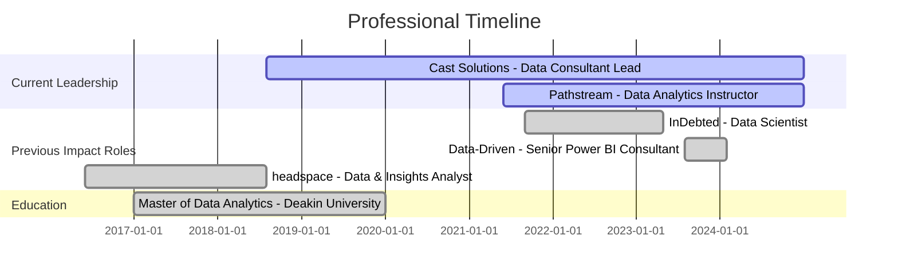

<div align="center">

<!-- HERO BANNER -->


<br/>

<!-- SOCIAL BADGES -->
<p>
  <a href="https://zerubroberts.com"></a>
  <a href="mailto:zerubroberts@gmail.com"></a>
  <a href="https://www.linkedin.com/in/zerubroberts"></a>
  <a href="tel:+61402681799"></a>
</p>

<br/>

<!-- KEY METRICS -->
<table>
  <tr>
    <td align="center" width="25%">
      
      <br/><b>8+ Years</b>
      <br/><sub>Industry Experience</sub>
    </td>
    <td align="center" width="25%">
      
      <br/><b>$2M+ Saved</b>
      <br/><sub>Cost Optimization</sub>
    </td>
    <td align="center" width="25%">
      
      <br/><b>50+ Projects</b>
      <br/><sub>Successfully Delivered</sub>
    </td>
    <td align="center" width="25%">
      
      <br/><b>100 hrs/day</b>
      <br/><sub>Time Saved via AI</sub>
    </td>
  </tr>
</table>

</div>

<br/>

---

## 🎯 About Me

```typescript
const zerub = {
    title: "Senior Data Scientist & AI Solutions Architect",
    location: "Melbourne, Australia 🇦🇺",
    experience: "8+ years transforming data into strategic business value",
    
    currentRoles: [
        "Data Consultant Lead @ Cast Solutions",
        "Data Analytics Instructor @ Pathstream (Amazon & Walmart)",
        "Independent ML Consultant"
    ],
    
    expertise: [
        "End-to-End ML Pipelines & MLOps",
        "Enterprise BI Architecture (Tableau, Power BI, Qlik)",
        "Predictive Analytics & Forecasting",
        "Cloud-Native Solutions (AWS, Azure, GCP)"
    ],
    
    impact: {
        costSavings: "$2M+",
        projectsDelivered: 50+,
        automationImpact: "100+ hours/day",
        studentSuccessRate: "98%"
    }
};
```

> **Currently:** Leading data transformation initiatives across Fortune 500 companies while mentoring the next generation of data professionals at Amazon & Walmart.

<br/>

---

## 💼 Featured Projects & Impact

<table>
<tr>
<td width="50%" valign="top">

### 🤖 Automated Email Triaging System
**FinTech | Production | $2M+ Annual Savings**

Built intelligent email classification system revolutionizing customer service operations.

**🎯 The Challenge**
- Manual email processing consuming 40% of operational costs
- Scaling issues with increasing customer volume

**💡 The Solution**
- ML-powered text classification with AWS Sagemaker
- Real-time routing and automated responses
- Full MLOps pipeline implementation

**📊 The Results**
- ✅ 40% email deflection rate
- ✅ 100 hours saved daily
- ✅ 70% accuracy maintained
- ✅ $2M+ annual cost savings

**Tech Stack:** `Python` `AWS Sagemaker` `NLP` `MLOps` `MLFlow`

</td>
<td width="50%" valign="top">

### ⚡ Predictive Power Failure System
**Utilities | Live Production | Multi-State Deployment**

Weather-based predictive maintenance system for power grid management.

**🎯 The Challenge**
- Reactive maintenance causing extended outages
- Inability to predict weather-related failures

**💡 The Solution**
- Ensemble ML models analyzing weather patterns
- Real-time monitoring and alerting system
- Integration with existing maintenance workflows

**📊 The Results**
- ✅ Now deployed across Eastern Victoria
- ✅ Proactive maintenance scheduling
- ✅ Reduced outage duration
- ✅ Cost savings through prevention

**Tech Stack:** `Python` `Ensemble Models` `Real-time APIs` `Weather Data`

</td>
</tr>
<tr>
<td width="50%" valign="top">

### 👷 Safety Compliance Detection
**Construction | Active | Real-time Monitoring**

Computer vision system for automated PPE compliance monitoring.

**🎯 The Challenge**
- Manual safety monitoring prone to human error
- Delayed incident detection

**💡 The Solution**
- Real-time computer vision detection
- Instant SMS alert system
- AWS Rekognition integration

**📊 The Results**
- ✅ Automated 24/7 monitoring
- ✅ Instant violation alerts
- ✅ Improved safety compliance
- ✅ Reduced workplace incidents

**Tech Stack:** `OpenCV` `AWS Rekognition` `Computer Vision` `SMS API`

</td>
<td width="50%" valign="top">

### 📈 Multi-Channel Volume Forecasting
**Customer Service | Production | 74% MAPE**

Advanced demand forecasting for resource optimization.

**🎯 The Challenge**
- Unpredictable customer service demand patterns
- Inefficient resource allocation

**💡 The Solution**
- Time series forecasting across multiple channels
- Country-specific models
- Integrated with roster management

**📊 The Results**
- ✅ 74% MAPE accuracy
- ✅ Proactive resource allocation
- ✅ Reduced customer wait times
- ✅ Optimized staffing costs

**Tech Stack:** `Time Series Analysis` `Python` `Statistical Modeling`

</td>
</tr>
</table>

<br/>

---

## 🛠️ Technology Stack

<div align="center">

### 🔥 Core Expertise

<table>
<tr>
<td align="center" width="33%">

#### 📊 Business Intelligence

<br/><br/>
**Tableau** ████████████ 95%<br/>
**Power BI** ███████████░ 90%<br/>
**Qlik Sense** ██████████░░ 85%<br/>
**Data Modeling** ████████████ 95%<br/>
<br/>
`8+ years` • `200+ dashboards` • `Fortune 500 clients`

</td>
<td align="center" width="33%">

#### 🤖 Machine Learning & AI

<br/><br/>
**Python** ████████████ 95%<br/>
**AWS Sagemaker** ███████████░ 90%<br/>
**TensorFlow** ████████░░░░ 80%<br/>
**MLOps** ██████████░░ 85%<br/>
<br/>
`8+ years` • `50+ models` • `30+ deployments`

</td>
<td align="center" width="33%">

#### ☁️ Cloud & Data Engineering

<br/><br/>
**Azure** ████████████ 95%<br/>
**AWS** ███████████░ 90%<br/>
**Snowflake** ██████████░░ 85%<br/>
**Spark** ████████░░░░ 80%<br/>
<br/>
`6+ years` • `100+ pipelines` • `Multi-cloud`

</td>
</tr>
</table>

### 🎨 Tech Stack Overview


</div>

<br/>

---

## 📊 Career Journey



<details>
<summary><b>🏢 View Detailed Experience Timeline</b></summary>

<br/>

### 🚀 Current Leadership Roles

#### **Data Consultant Lead** @ Cast Solutions
*Aug 2018 - Present (6+ years)*

**Leading multi-sector data transformation initiatives**

- 🏢 **Multi-industry expertise:** Engineering, utilities, healthcare, technology
- 📊 **Delivery record:** 50+ end-to-end BI solutions
- 🔮 **Innovation:** Predictive analytics, geo-analytics, computer vision, IoT integration
- 👥 **Leadership:** Managing teams of 5-8 data professionals
- 🏆 **Recognition:** Qlik APAC Partner of the Year (ANU Energy Dashboard)

**Key Technologies:** Tableau, Power BI, Qlik, Python, SQL, AWS, Azure, ML

---

#### **Data Analytics Instructor** @ Pathstream
*Jun 2021 - Present (3+ years)*

**Mentoring Amazon & Walmart professionals in data analytics**

- 📚 **Students trained:** 500+ professionals
- 🎯 **Success rate:** 98% pass rate in Tableau certification
- ⭐ **Rating:** 4.9/5.0 instructor rating
- 📖 **Curriculum:** Created project-specific assessment rubrics and hands-on projects

---

### 📈 Previous High-Impact Roles

#### **Data Scientist** @ InDebted
*Sep 2021 - Apr 2023 (1.5 years)*

**Remote-first, globally distributed FinTech startup**

**🏆 Key Achievement:** Built automated email triaging system saving $2M+ annually

- 🤖 **ML Deployment:** Text classification achieving 70% accuracy, 40% email deflection
- 📊 **Forecasting:** Multi-channel volume forecasting with 74% MAPE accuracy
- ⚙️ **MLOps:** Full CI/CD pipeline with MLFlow tracking and model monitoring
- 💰 **Business Impact:** Quantified $-value impact across multiple ML models

**Tech Stack:** Python, AWS Sagemaker, Snowflake, DBT, Dagster, MLFlow

---

#### **Senior Power BI Consultant** @ Data-Driven
*Aug 2023 - Jan 2024*

**Enterprise BI solutions for Fortune 500 clients**

- 🏢 **Clients:** Fortune 500 companies across multiple industries
- ⚡ **Performance:** Achieved 80% faster dashboard load times through optimization
- 📊 **Strategic impact:** Enabled C-suite data-driven decision making
- 🎯 **Expertise:** Advanced DAX, data modeling, performance tuning

---

#### **Data & Insights Analyst** @ headspace
*Jun 2017 - Aug 2018*

**Healthcare analytics and visualization systems**

- 📊 **Standardization:** Designed tableau dashboards now used across 130+ centers
- 🗺️ **Innovation:** Integrated ABS data with internal sources for optimal center locations
- 🤖 **Automation:** Python scripts for monthly/quarterly data extracts and reporting
- 📈 **Research support:** Custom visualizations for complex dataset interactions

</details>

<br/>

---

## 🎓 Education & Certifications

<table>
<tr>
<td width="50%">

### 🎓 Academic Background

**Master of Data Analytics** (83%)  
*Deakin University* • 2017-2019

**Bachelor of Science**  
Mathematics & Computer Science  
*Andhra University* • 2013-2016

</td>
<td width="50%">

### 📜 Professional Certifications

✅ **Data Architect** - Qlik  
✅ **AutoML Implementation Specialist** - Qlik  
✅ **Professional Program in Data Science** - Microsoft  
✅ **Machine Learning Specialization** - University of Washington  
✅ **Azure Machine Learning** - Microsoft  
✅ **Apache Spark Fundamentals**  
✅ **Google Cloud Platform** - Computing, Storage & Security  

</td>
</tr>
</table>

<br/>

---

## 🌟 Open Source Contributions

### Qlik Sense Extensions

<table>
<tr>
<td align="center" width="33%">

<br/>
<b>Risk Heatmap</b>
<br/>
<sub>Risk Matrix visualization extension</sub>
<br/><br/>
<a href="https://github.com/zerubroberts/qlik-risk-heatmap">

</a>
</td>
<td align="center" width="33%">

<br/>
<b>KPI Gauge Card</b>
<br/>
<sub>Multiple gauge KPIs in card format</sub>
<br/><br/>
<a href="https://github.com/zerubroberts/qlik-kpi-guage-card-extension">

</a>
</td>
<td align="center" width="33%">

<br/>
<b>Response Visualizer</b>
<br/>
<sub>Assessment responses visualization</sub>
<br/><br/>
<a href="https://github.com/zerubroberts/qlik-sc-responses-visualizer">

</a>
</td>
</tr>
</table>

<br/>

---

## 📰 Featured Work & Media

<table>
<tr>
<td width="50%" valign="top">

### 📰 Case Studies & Customer Stories

**🏛️ [Australian National University](https://www.qlik.com/us/solutions/customers/customer-stories/australian-national-university)**  
Data analytics transformation in higher education  
*Featured: Energy consumption dashboard for ANU Below Zero Initiative*

**💳 [InDebted - ML Collections Strategy](https://www.indebted.co/blog/guides/improving-collections-strategy-by-30-with-machine-learning/)**  
30% improvement in collections strategy using ML  
*Featured: Machine learning implementation case study*

</td>
<td width="50%" valign="top">

### 📺 Media Coverage

**📊 [6clicks - Power BI Dashboard](https://www.6clicks.com/resources/blog/introducing-the-new-6clicks-dashboards-on-power-bi)**  
Enterprise BI solution deployment  
*Featured: Power BI dashboard implementation*

**⚡ [Energy Safe Victoria](https://safetyinsights.au/case-studies/energysafevictoria)**  
Safety compliance and analytics system  
*Featured: Safety analytics platform development*

**📰 [ABC News - ANZSCO Analysis](https://www.abc.net.au/news/2019-08-17/anzsco-occupation-lists-need-updating/11413518)**  
Data analysis for workforce classification systems  
*Featured: Data-driven policy recommendations*

</td>
</tr>
</table>

<br/>

---

## 📫 Let's Connect

<div align="center">

### 💬 Open for Opportunities

I'm always interested in discussing:
- 🚀 Data Science & AI Consulting Projects
- 💼 Enterprise BI & Analytics Solutions
- 🎓 Training & Mentorship Opportunities
- 🤝 Collaboration on Innovative Data Projects

<br/>

<table>
<tr>
<td align="center">

<br/>
<b>Website</b>
<br/>
<a href="https://zerubroberts.com">zerubroberts.com</a>
</td>
<td align="center">

<br/>
<b>Email</b>
<br/>
<a href="mailto:zerubroberts@gmail.com">zerubroberts@gmail.com</a>
</td>
<td align="center">

<br/>
<b>LinkedIn</b>
<br/>
<a href="https://linkedin.com/in/zerubroberts">@zerubroberts</a>
</td>
<td align="center">

<br/>
<b>Phone</b>
<br/>
<a href="tel:+61402681799">+61 402 681 799</a>
</td>
</tr>
</table>

<br/>

### 📊 GitHub Stats


<br/>

---

<sub>💡 *Transforming raw data into strategic insights that drive measurable business value*</sub>

<br/>


</div>
